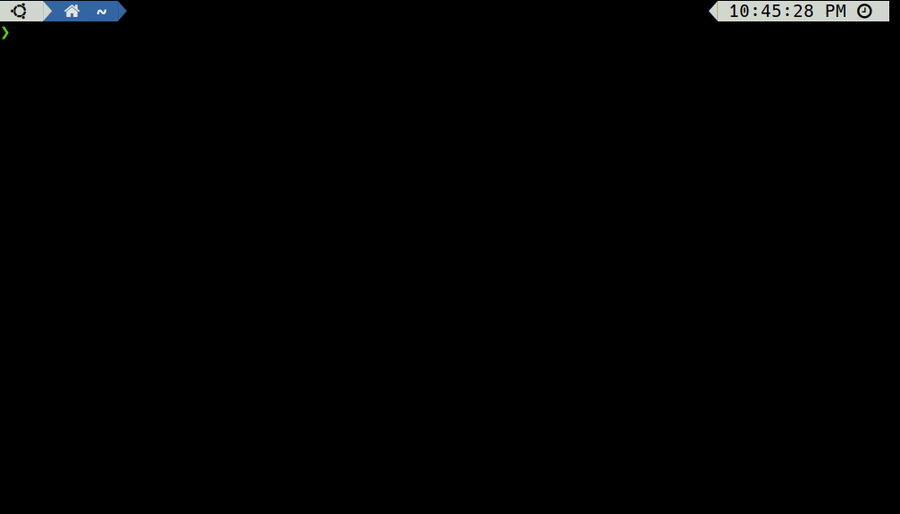

[](https://github.com/sse-secure-systems/connaisseur/blob/master/LICENSE)
[](https://codecov.io/gh/sse-secure-systems/connaisseur)


<!-- # Connaisseur -->

A Kubernetes admission controller to integrate container image signature verification and trust pinning into a cluster.

**:point_right: The full documentation is available [here](https://sse-secure-systems.github.io/connaisseur/) :book:**

**:point_right: Feel free to reach out via [GitHub Discussions](https://github.com/sse-secure-systems/connaisseur/discussions) :speech_balloon:**

## What is Connaisseur?

Connaisseur ensures integrity and provenance of container images in a Kubernetes cluster.
To do so, it intercepts resource creation or update requests sent to the Kubernetes cluster, identifies all container images and verifies their signatures against pre-configured public keys.
Based on the result, it either accepts or denies those requests.

Connaisseur is developed under three core values: *Security*, *Usability*, *Compatibility*.
It is built to be extendable and currently aims to support the following signing solutions:

- [Notary V1](https://github.com/theupdateframework/notary) / [Docker Content Trust](https://docs.docker.com/engine/security/trust/)
- [Sigstore](https://sigstore.dev/) / [Cosign](https://github.com/sigstore/cosign)
- [Notary V2](https://github.com/notaryproject/nv2) (PLANNED)

It provides several additional features:

- [Detection Mode](docs/features/detection_mode.md): *warn but do not block invalid images*
- [Namespaced Validation](docs/features/namespaced_validation.md): *restrict validation to dedicated namespaces*
- [Alerting](docs/features/alerting.md): *send alerts based on verification result*


## Quick start

Getting started to verify image signatures is only a matter of minutes:



> :warning: Only try this out on a test cluster as deployments with unsigned images will be blocked. :warning:

Connaisseur comes pre-configured with public keys for its own repository and [Docker's official images](https://docs.docker.com/docker-hub/official_images/) (official images can be found [here](https://hub.docker.com/search?q=&type=image&image_filter=official)).
It can be fully configured via `helm/values.yaml`.
For a quick start, clone the Connaisseur repository:

```bash
git clone https://github.com/sse-secure-systems/connaisseur.git
```

Next, install Connaisseur via [Helm](https://helm.sh):

```bash
helm install connaisseur helm --atomic --create-namespace --namespace connaisseur
```

Once installation has finished, you are good to go.
Successful verification can be tested via official Docker images like `hello-world`:

```bash
kubectl run hello-world --image=docker.io/hello-world
```

Or our signed `testimage`:

```bash
kubectl run demo --image=docker.io/securesystemsengineering/testimage:signed
```

Both will return `pod/<name> created`. However, when trying to deploy an unsigned image:

```bash
kubectl run demo --image=docker.io/securesystemsengineering/testimage:unsigned
```

Connaisseur denies the request and returns an error `(...) Unable to find signed digest (...)`. Since the images above are signed using Docker Content Trust, you can inspect the trust data using `docker trust inspect --pretty <image-name>`.

To uninstall Connaisseur use:

```bash
helm uninstall connaisseur --namespace connaisseur
```

Congrats :tada: you just validated the first images in your cluster!
To get started configuring and verifying your own images and signatures, please follow our [setup guide](https://sse-secure-systems.github.io/connaisseur/latest/getting_started/).

## Discussions, support & feedback
We hope to steer development of Connaisseur from demand of the community, are excited about your feedback and happy to help if you need support! So feel free to connect with us via [GitHub Discussions](https://github.com/sse-secure-systems/connaisseur/discussions).

## Contributing
We are always excited about direct contributions to improve the tool! Please refer to our [contributing guide](docs/CONTRIBUTING.md) to learn how to contribute to Connaisseur.

## Security policy

We are grateful for any community support reporting vulnerabilities! How to submit a report is described in our [Security Policy](docs/SECURITY.md).

## Wall of fame

Thanks to all the fine people directly contributing commits/PRs to Connaisseur:

<a href="https://github.com/sse-secure-systems/connaisseur/graphs/contributors">
  
</a>

Big shout-out also to all who support the project via issues, discussions and feature requests :pray:

## Contact

You can reach us via email under [connaisseur@securesystems.dev](mailto:connaisseur@securesystems.dev).
